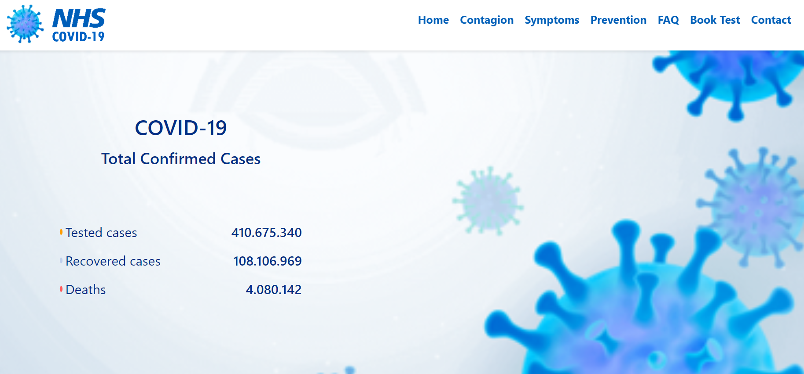

# COVID-19 Information Portal

This project aims to design and develop a user-friendly and informative web application for providing up-to-date COVID-19 statistics, prevention guidelines, testing information, and emergency resources.

## Table of Contents
1. [Description](#description)
2. [Project Objective](#project-objective)
3. [Project Goals](#project-goals)
4. [Technologies Used](#technologies-used)
5. [Features](#features)
6. [Installation](#installation)
7. [Usage](#usage)
8. [Contributing](#contributing)
9. [License](#license)

## Features
- Global COVID-19 Data & Current COVID-19 Statistics: Real-time statistics including total cases, tests conducted, recoveries, and deaths displayed in a user-friendly table format for 45 countries.
-Global COVID-19 Data Visualization: Enhanced user experience with colorful and informative pie charts visualizing the numerical data.
-COVID-19 Information & Resources: Basic information on COVID-19, its transmission, symptoms, prevention methods sourced from reliable authorities such as CDC, WHO, and NHS.
-COVID-19 Testing & Order for COVID-19 Tests: Step-by-step guide on how to get tested for COVID-19 based on NHS guidelines.
-Emergency Contact (999) & Symptoms: Information on recognizing symptoms requiring emergency attention and how to contact emergency services.
-NHS COVID-19 Test Application: Users can apply for a COVID-19 test by filling out the test request form on the website.
-Order COVID-19 Test Kit & Automatic Confirmation Email after Booking a Test: Users can order a test kit by entering their NHS number and necessary personal details.

## Project Objective
The primary goal of the COVID-19 Information Website is to offer users the latest and precise COVID-19 case statistics, simplify the process of requesting Covid-19 tests, and guarantee access to reliable information regarding the illness.

## Project Goals
1) Providing Current COVID-19 Data:
   - Data Sourcing: It should be noted that as of the date of the Project, there is no direct data available for COVID-19 cases in the NHS and WHO APIs. Therefore, to provide current data, the Apify API will be utilized, and dummy data obtained from 'https://api.apify.com/v2/key-value-stores/tVaYRsPHLjNdNBu7S/records/LATEST?disableRedirect=true' will be used.
   - Data Updating: These data will be stored in the database instantly whenever the website is updated and made display for to users. This ensures that the website operates in a manner to provide up-to-date data for each visitor.
2) Showing Global COVID-19 Data:
   - Numerical Data Presentation: In this scope, data for a total of 45 countries (Algeria, Austria, Azerbaijan, Bahrain, Belgium, Brazil, Bulgaria, Canada, China, Czech Republic, Denmark, Finland, France, Germany, Honduras, Hungary, India, Iran, Italy, Japan, Luxembourg, Malaysia, Netherlands, Nigeria, Norway, Pakistan, Palestine, Philippines, Poland, Portugal, Romania, Russia, Saudi Arabia, Serbia, Singapore, Slovakia, Slovenia, South Korea, Spain, Sweden, Switzerland, Turkey, United Kingdom, United States, Vietnam) will be presented in a modern table format with numbers, showing the total COVID-19 cases, number of tests conducted, number of recoveries, and number of deaths.
   - Pie Chart Data Presentation: Below these numerical data, the information will be visually presented in user-friendly and understandable pie charts supported by colours and numbers.

## Technologies Used
- MySQL for database
- HTML5 and CSS3 for frontend
- JavaScript and PHP for backend
- Apify API for data sourcing

## Architecture
-Single-page application built with PHP, MySQL, HTML5, CSS3, and JavaScript for a modern and user-friendly experience.
-Optimized for responsiveness across devices.

## Pages
1. Home: Overview of current COVID-19 statistics and country selection.
2. Contagions: Infographics illustrating various transmission methods.
3. Symptoms: List of COVID-19 symptoms and treatment options.
4. Prevention: Guidelines on preventive measures such as mask usage, social distancing, and hand hygiene.
5. FAQ: Frequently asked questions about COVID-19 with detailed answers.
6. Book Test: Form for users to request a COVID-19 test and information on the testing process.
7. Contact: Contact form for users to reach site administrators.

## Installation
To run the application locally:

1. Install PHP, MySQL, and a web server (e.g., Apache).
2. Import the provided database dump located in database/dump.sql.
3. Update database credentials in config/config.php.
4. Start the web server.

OR/

1. Clone the repository: `git clone https://github.com/your-username/your-repo.git`
2. Install dependencies: `npm install`
3. Run the application: `npm start`

## How to Contribute
Contributions are welcome! Please fork the repository and submit a pull request.

1. Fork the repository.
2. Clone the forked repository to your local machine.
bash
Copy code
git clone https://github.com/your-username/covid-19-portal.git
3. Create a new branch.
bash
Copy code
git checkout -b feature/new-feature
4. Make your changes, commit, and push to your branch.
bash
Copy code
git add .
git commit -m "Add new feature"
git push origin feature/new-feature
5. Create a pull request.

## Usage
- Visit the website and navigate through different sections
- View current COVID-19 statistics
- Access global COVID-19 data
- Learn about COVID-19 information and prevention measures
- Order for COVID-19 tests
- Get information on emergency situations and symptoms

## License
This project is licensed under the MIT License - see the [LICENSE](LICENSE) file for details.

## Home Page

## Country Chart

## Order Covid-19 Test

